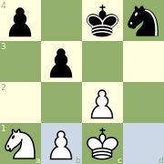

# octad
[](https://godoc.org/github.com/dechristopher/octad)
[](https://goreportcard.com/report/dechristopher/octad)
[](https://raw.githubusercontent.com/dechristopher/octad/master/LICENSE)

**octad** is a set of go packages which provide common octad chess variant
utilities such as move generation, turn management, checkmate detection,
a basic engine, PGN encoding, image generation, and others.

## Repo Structure

| Package    | Docs Link                                    | Description                                                                             |
| ---------- | -------------------------------------------- | --------------------------------------------------------------------------------------- |
| **octad**  | [dechristopher/octad](README.md)             | Move generation, serialization / deserialization, turn management, checkmate detection  |
| **image**  | [dechristopher/octad/image](image/README.md) | SVG octad board image generation                                                        |

## Installation

**chess** can be installed using "go get".

```bash
go get -u github.com/dechristopher/octad
``` 

## Octad Game
Octad was conceived by Andrew DeChristopher in 2018. Rules and information about
the game can be found below. Octad is thought to be a solved, deterministic game
but needs formal verification to prove that. This repository exists as an effort
towards that goal.

### Board Layout
Each player begins with four pieces: a knight, their king, and two pawns placed
in that order from left to right relative to them. An example of this can be
seen in the board diagrams below:


### Rules
All standard chess rules apply:

* En passant is allowed
* Pawn promotion to any piece
* Stalemates are a draw

The only catch, however, is that castling is possible between the king and any
of its pieces on the starting rank before movement. The king will simply switch
spaces with the castling piece in all cases except the far pawn, in which case
the king will travel one space to the right, and the pawn will lie where the
king was before. An example of white castling with their far pawn can be
expressed as `[ 1. c2 b3 2. O-O-O ... ]` with the resulting structure leaving
the knight on a1, a pawn on b1, the king on c1, and the other pawn on c2. Here
is what that would look like on the board:



#### Castling notation
* Knight-color castle: **O**
* Close pawn castle: **O-O**
* Far pawn castle: **O-O-O**