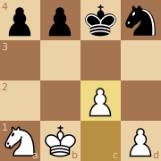

# image

## Introduction

**image** is an octad image utility that converts board positions into
[SVG](https://en.wikipedia.org/wiki/Scalable_Vector_Graphics), or Scalable
Vector Graphics, images.  [svgo](https://github.com/ajstarks/svgo), the only
outside dependency, is used to construct the SVG document.

## Usage

### SVG

The SVG function is the primary exported function of the package. It writes an
SVG document to the io.Writer given.

```go
file, _ := os.Open("output.svg")
defer file.Close()
fenStr := "ppkn/4/2P1/NK1P b NCFncf - 0 1"
pos := &octad.Position{}
pos.UnmarshalText([]byte(fenStr))
image.SVG(file, pos.Board())
```

### Dark / Light Square Customization

The default colors, shown in the example SVG below, are (235, 209, 166) for
light squares and (165, 117, 81) for dark squares. The light and dark squares
can be customized using the SquareColors() option.

```go
white := color.RGBA{255, 255, 255, 1}
gray := color.RGBA{120, 120, 120, 1}
sqrs := image.SquareColors(white, gray)
image.SVG(file, pos.Board(), sqrs)
```

### Marked Squares

MarkSquares is designed to be used as an optional argument to the SVG function.
It marks the given squares with the color. A possible usage includes marking
squares of the previous move.

```go
yellow := color.RGBA{R: 255, G: 255, B: 0, A: 1}
mark := image.MarkSquares(yellow, octad.C1, octad.C2)
image.SVG(file, pos.Board(), mark)
```

### Example Program

```go
package main

import (
	"image/color"
	"log"
	"os"

	"github.com/dechristopher/octad"
	"github.com/dechristopher/octad/image"
)

func main() {
    // create file
    f, err := os.Create("example.svg")
    if err != nil {
        log.Fatal(err)
    }
    defer f.Close()

    // create board position
    fenStr := "ppkn/4/2P1/NK1P b NCFncf - 0 1"
    pos := &octad.Position{}
    if err := pos.UnmarshalText([]byte(fenStr)); err != nil {
        log.Fatal(err)
    }

    // write board SVG to file
    yellow := color.RGBA{R: 255, G: 255, B: 0, A: 1}
    mark := image.MarkSquares(yellow, octad.C1, octad.C2)
    if err := image.SVG(f, pos.Board(), mark); err != nil {
        log.Fatal(err)
    }
}
```

### Example Program Result


 